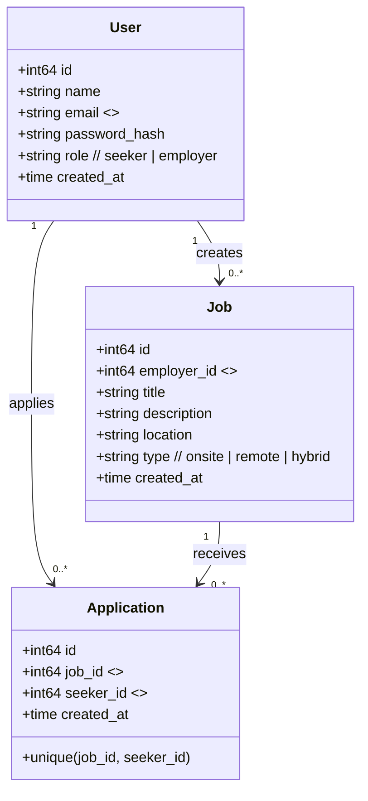

```mermaid

classDiagram

    class User {
        +int64 id
        +string name
        +string email <<unique>>
        +string password_hash
        +string role  // seeker | employer
        +time created_at
    }

    class Job {
        +int64 id
        +int64 employer_id <<FK>>
        +string title
        +string description
        +string location
        +string type  // onsite | remote | hybrid
        +time created_at
    }

    class Application {
        +int64 id
        +int64 job_id <<FK>>
        +int64 seeker_id <<FK>>
        +time created_at
        +unique(job_id, seeker_id)
    }

    User "1" --> "0..*" Job : creates
    User "1" --> "0..*" Application : applies
    Job "1" --> "0..*" Application : receives

```